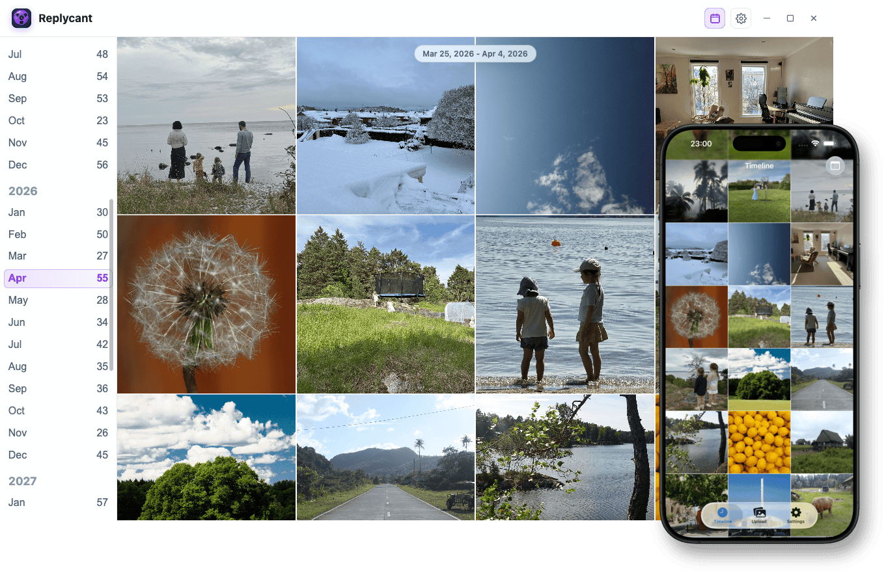

# Replycant

A self-hosted photo library focused on privacy, data durability, and ease of use.

Replycant is a simple photo library based on proven technologies. It uses Git with LFS for storage of metadata and binary objects, mTLS for client authentication, Age for key encryption and AES-GCM for metadata/object encryption.

Part of Replycant is also an open source iOS app which is published on the app store.



## Why Replycant

- **Untrusted server** — media and metadata are encrypted on-device; the server never sees plaintext
- **Git-backed storage (GitDB)** — ordinary push/pull sync, full history, easy backup and mirroring. Binary objects stored in Git LFS.
- **Zero-conf hosting** — bring up the stack with Docker Compose. No configuration needed.
- **Inspectable data** — YAML manifests and Git history you can read with ordinary tools

## Getting started

**1. Start the server**

Download [`docker-compose.yaml`](https://github.com/mr-andreas/replycant/releases/latest/download/docker-compose.yaml)
from the latest GitHub Release, and then start it:

```bash
curl -fsSL -o docker-compose.yaml \
  https://github.com/mr-andreas/replycant/releases/latest/download/docker-compose.yaml
docker compose up
```

This will use the directory where you have placed docker-compose.yaml for both metadata and binary storage, which is usually fine. If you wish to select another directory or change the published ports, create a `.env`, then bring the stack up:

```bash
cat > .env << EOF
REPLYCANT_DATA_DIR=/var/lib/replycant/data
REPLYCANT_LFS_DIR=/var/lib/replycant/lfs
REPLYCANT_GIT_PORT=8443
REPLYCANT_CA_PORT=8080
EOF
```

The Git server listens on port `8443` (HTTPS) by default. On the LAN it
advertises as `<hostname>.local`. Set `REPLYCANT_HOSTNAME` to override
that name, and `REPLYCANT_GIT_PORT` and `REPLYCANT_CA_PORT` when those
defaults are already in use. Already-linked devices need re-onboarding
after a hostname or port change.

> **Note:** On Mac and Windows, Docker runs in a VM, so hostname
> auto-detection does not work. Set the name this computer uses on the
> LAN before starting the stack:
>
> ```bash
> echo REPLYCANT_HOSTNAME=$(hostname) >> .env
> docker compose up
> ```

**2. Install the iOS client**

[iOS app on the App Store](https://apps.apple.com/se/app/replycant/id6760653798)

**3. Link a device**

Using your computer, open the URL that you host the server on. Usually, this is http://localhost:8080 (or `http://localhost:$REPLYCANT_CA_PORT` if you changed the CA port). Start the iOS app and scan the QR code.

## Policies and support

- [Privacy policy](./PRIVACY.md)
- [Support](./SUPPORT.md)
