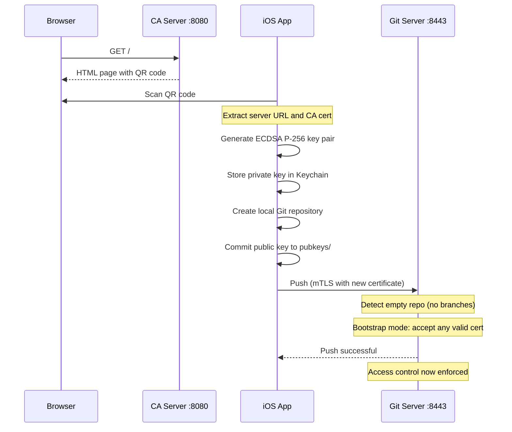
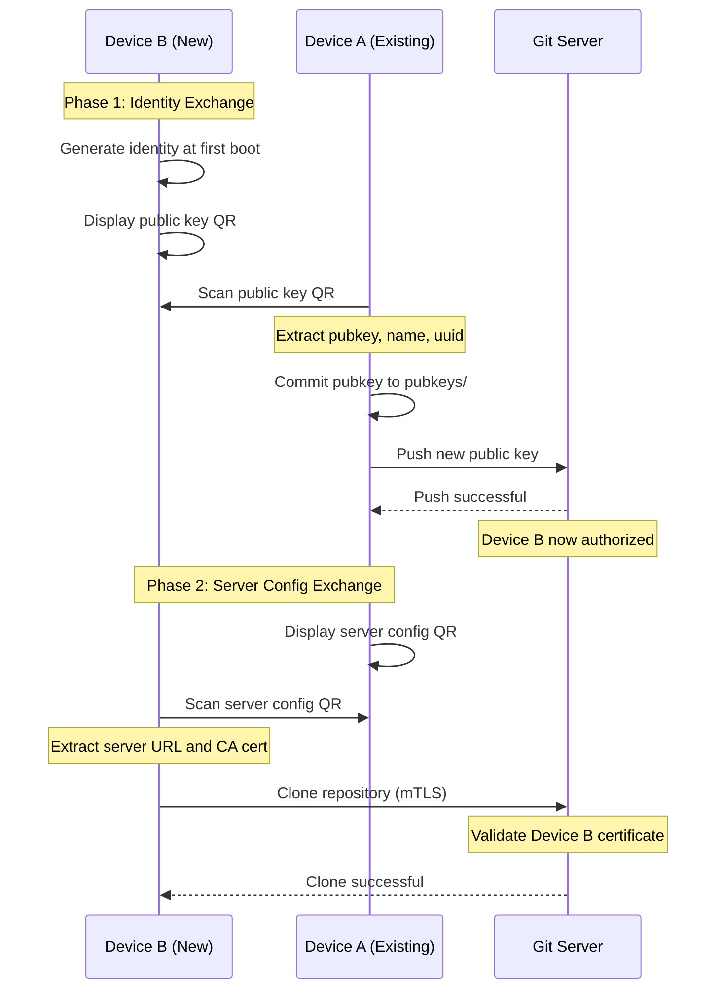
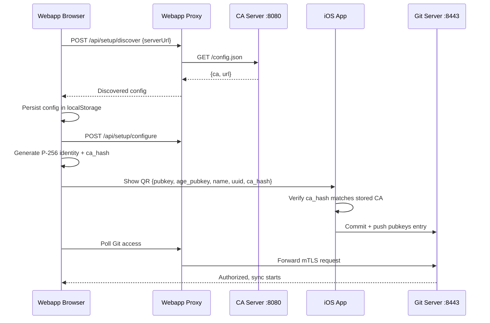

# Device Onboarding

Adding devices to a GitDB repository follows one of two flows: bootstrapping a new repository with the first device, or linking additional devices to an existing repository. Both flows use mTLS authentication with ECDSA P-256 certificates and QR codes to exchange configuration.

## Overview

| Scenario | Description |
|----------|-------------|
| Bootstrap Mode | First device creates repository and establishes access control |
| Device Linking | Existing device authorizes new device via public key exchange |

Both flows result in:
- Device identity (ECDSA P-256 key pair) stored in iOS Keychain
- Public key committed to `pubkeys/` directory in repository
- Device can authenticate via mTLS for all Git operations

## Bootstrap Mode (First Device)

Bootstrap mode allows the first device to push to an empty repository without pre-configured keys. This is how a new GitDB repository is initialized.

### Flow



### Step-by-Step

1. **Obtain server configuration**: User opens CA server URL in browser and scans the displayed QR code
2. **Generate identity**: App creates ECDSA P-256 key pair and stores private key in iOS Keychain
3. **Create repository**: App initializes local Git repository at `~/Documents/replycant-git-db`
4. **Commit public key**: App adds public key to `pubkeys/{device-name}.pub`
5. **Push to server**: App pushes using mTLS; server accepts because repository is empty
6. **Access control active**: Subsequent connections require certificate matching a key in `pubkeys/`

### Race Condition Prevention

When multiple devices attempt to bootstrap simultaneously, a mutex prevents race conditions:

1. Server detects empty repository (no branches)
2. Server acquires bootstrap mutex lock
3. Authentication re-checked after acquiring lock
4. If repository still empty, push proceeds
5. If another device pushed first, normal authentication applies

This ensures exactly one device can perform the initial bootstrap.

### Security Considerations

| Consideration | Mitigation |
|---------------|------------|
| First push wins | Initialize repositories in controlled environments |
| No pre-authorization | Consider pre-populating `pubkeys/` for production |
| Physical access required | QR code scanning requires camera access to server display |

## Device Linking (Adding to Existing Repository)

When a repository already has authorized devices, new devices must be explicitly authorized by an existing device. This uses a two-phase QR code exchange.

### Flow



### Phase 1: Identity Exchange

1. **Device B generates identity**: At first launch, Device B creates ECDSA P-256 key pair
2. **Device B displays QR**: Shows public key, device name, and UUID as QR code
3. **Device A scans QR**: Reads Device B's public key information
4. **Device A commits key**: Adds `pubkeys/{name}-{uuid}.pub` to repository
5. **Device A pushes**: Server now recognizes Device B's certificate

### Phase 2: Server Configuration Exchange

1. **Device A displays config QR**: Shows server URL and CA certificate
2. **Device B scans QR**: Obtains connection information
3. **Device B clones**: Uses mTLS with its certificate (now authorized)
4. **Sync complete**: Both devices have identical repository state

### Why Two Phases?

The two-phase exchange solves the authorization chicken-and-egg problem:

- Device B cannot clone without being authorized
- Device B cannot be authorized without Device A knowing its public key
- Device A cannot know Device B's key without some exchange mechanism
- QR codes provide a secure, offline exchange channel

## QR Code Formats

### Server Configuration QR

Generated by CA server or displayed by existing device during linking:

```json
{
  "url": "mtls+https://server.example.com:8443/",
  "ca": "-----BEGIN CERTIFICATE-----\n...\n-----END CERTIFICATE-----"
}
```

| Field | Description |
|-------|-------------|
| `url` | Git server URL with `mtls+https://` scheme for custom transport |
| `ca` | PEM-encoded CA certificate for server validation (pinning) |

Clients derive the LFS endpoint as `{origin(url)}/lfs`.

### Public Key QR

Displayed by new device during linking:

```json
{
  "pubkey": "ecdsa-sha2-nistp256 AAAAE2VjZHNhLXNoYTItbmlzdHAyNTYAAAAI...",
  "age_pubkey": "age1q...",
  "name": "iphone-15-pro",
  "uuid": "A1B2C3D4-E5F6-7890-ABCD-EF1234567890",
  "ca_hash": "4f2b8c9a..."
}
```

| Field | Description |
|-------|-------------|
| `pubkey` | SSH-format ECDSA P-256 public key |
| `age_pubkey` | Bech32-encoded age X25519 public key for encryption |
| `name` | Human-readable device name |
| `uuid` | Unique device identifier (prevents name collisions) |
| `ca_hash` | SHA256 of CA certificate DER bytes (hex, 64 chars). Present only in webapp QR codes. |

## Webapp-First Onboarding

The webapp onboarding flow mirrors device linking trust semantics but begins with browser-side server discovery:



1. User opens an uninitialized webapp and enters the CA server URL.
2. Webapp discovery fetches CA + upstream URLs from `/config.json`.
3. Browser stores discovered setup in localStorage and configures the proxy.
4. User creates identity (device name + optional password).
5. Webapp generates a P-256 key pair and computes `ca_hash` from CA DER bytes (SHA256 hex).
6. Webapp displays QR payload `{pubkey, age_pubkey, name, uuid, ca_hash}`.
7. iOS scans the QR, verifies `ca_hash` against its configured CA, then commits the key.
8. Webapp polls for authorization and proceeds to clone/sync once the key is accepted.

`ca_hash` is optional across the full protocol: iOS-to-iOS public key QR codes omit it, while webapp-generated QR codes include it and trigger CA verification before key commit.

## Recovery Onboarding Path

When all existing device keys are lost, onboarding supports a recovery path that
starts from a recovery bundle instead of a pairing QR from another device.

### Recovery entry points

- Onboarding action: **Recover with a recovery key**
- In-app recovery scanner: QR mode that accepts recovery envelope JSON
- Deep link: `replycant://recover?v=1&d=...`

### Recovery sequence

1. User provides/scans recovery bundle and enters bundle password.
2. App decrypts bundle and discovers server config from `discovery_url`.
3. App verifies discovered CA hash against pinned `ca_sha256`.
4. App authenticates once with temporary recovery identity.
5. App clones repository, registers a new normal device key, and re-wraps KEK
   epochs for the new device age key.
6. App switches back to normal device identity and deletes temporary recovery
   identity artifacts.

Recovery is rejected if the app is already configured locally; users must
reinstall first to avoid mixing recovery with an existing identity context.

## Key Cache Behavior

An authorized device connects on its first attempt after the pubkey push lands on `main`. A removed key stops working just as promptly. The server reloads authorized keys whenever `main` moves, so enrollment and revocation do not wait on a cache timer.

## Security Properties

| Property | Bootstrap Mode | Device Linking |
|----------|----------------|----------------|
| Authorization | First push wins | Explicit by existing device |
| Key exchange | Via CA server QR | Via device-to-device QR |
| Audit trail | Git history of pubkeys/ | Git history of pubkeys/ |
| Revocation | Remove key from pubkeys/ | Remove key from pubkeys/ |

## Related Documentation

- [Authentication](./authentication.md) - mTLS protocol and certificate details
- [Server Architecture](./server-architecture.md) - Server-side bootstrap mode implementation
- [Device Identity](../replycant-ios/device-identity.md) - Immutable identity lifecycle
