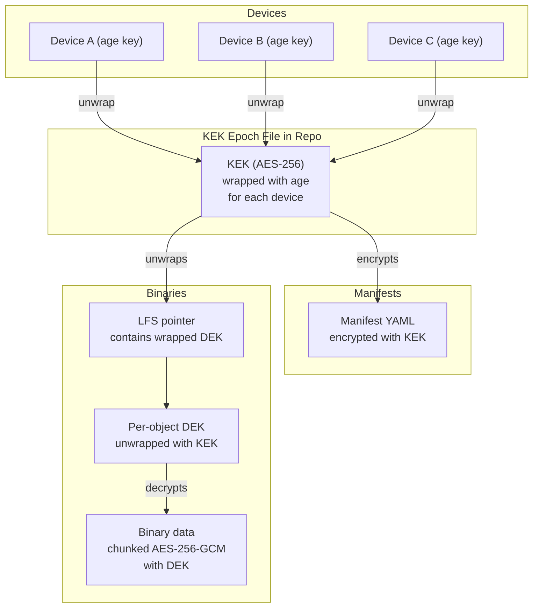
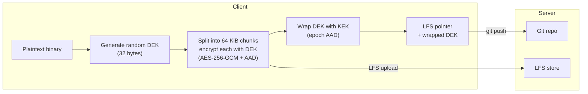

# Encryption

GitDB encrypts all data at rest using a KEK/DEK envelope encryption scheme. The server stores only opaque encrypted blobs and never has access to plaintext. All encryption and decryption happens on the client device.

## Threat Model

The server is an untrusted storage layer. A server compromise should not expose user data. Transport security ([mTLS](./authentication.md)) protects data in transit; encryption at rest protects data on the server.

## Overview

Three layers of encryption protect data:

1. **age key wrapping** (X25519) -- wraps the KEK for each authorized device
2. **KEK** (Key Encryption Key, AES-256) -- encrypts manifests directly, wraps per-object DEKs for binaries
3. **DEK** (Data Encryption Key, AES-256, per binary) -- encrypts individual binary objects



Any device whose age public key is registered in `pubkeys/` can decrypt all objects. Adding a device only requires re-wrapping the small KEK epoch file. Revoking a device only requires creating a new KEK epoch.

## Encryption Keys

Each device has two key pairs:

| Key | Algorithm | Purpose | Storage |
|-----|-----------|---------|---------|
| Identity key | ECDSA P-256 | [mTLS authentication](./authentication.md) | iOS Keychain / webapp encrypted localStorage (OS keyring or password wrap) |
| Encryption key | age (X25519) | KEK unwrapping | iOS Keychain / webapp encrypted localStorage (OS keyring or password wrap) |

### age Public Key Storage

Encryption public keys are stored alongside identity public keys in the repository:

```
pubkeys/
  device-a.pub        # P-256 SSH key (mTLS)
  device-a.age        # age public key (encryption)
  device-b.pub
  device-b.age
```

### Why age

[age](https://github.com/FiloSottile/age) was chosen over GPG and raw ECIES with P-256 because:

- Minimal protocol with no configuration, key servers, or web of trust
- A public key is a single ~62-character string
- Small enough to implement natively using Apple CryptoKit (Curve25519 + ChaCha20-Poly1305) and the `age-encryption` npm package, without shelling out to a CLI

## KEK Epoch Management

The KEK is a random 32-byte AES-256 key used to encrypt manifests and wrap per-object DEKs. It is stored in the repository encrypted with age for all authorized devices.

### Repository Structure

```
gitdb/
  version              # plain text: database format version (e.g., "1")
encryption/
  current              # plain text: active epoch number (e.g., "2")
  epochs/
    1.age              # KEK epoch 1, age-encrypted for all recipients
    2.age              # KEK epoch 2 (after key rotation)
```

`gitdb/version` pins the repository layout and crypto handling. Clients refuse
any other value. See [Database format version](./database-version.md). Manifest
schemas stay under each resource's `apiVersion`.

### Key Lifecycle

| Event | Action | Re-encrypts objects? |
|-------|--------|----------------------|
| New device added | Decrypt all KEK epoch files, re-encrypt including new device's age key, commit | No |
| Device removed | Generate new KEK, encrypt for remaining devices, bump `current` | No |
| Key rotation | Same as device removal -- new KEK epoch, old epochs remain in history | No |
| Full revocation | Re-encrypt all epochs without revoked key and rewrite Git history | Yes (destructive) |

After creating a new KEK epoch, all new objects are encrypted with the new KEK. A revoked device retains old KEKs from Git history and can decrypt old objects, but cannot decrypt anything encrypted with the new KEK. This provides "from now on" forward secrecy.

## Manifest Encryption

Manifests are encrypted directly with the current KEK using AES-256-GCM. No per-manifest DEK is used -- manifests are small, numerous, and don't require granular sharing.

### Encrypted Format

The encrypted manifest replaces the plaintext YAML in the repository:

```
REPLYCANT-ENC-V1
kek-epoch: 2
---
<12-byte nonce><ciphertext><16-byte GCM tag>
```

- The plaintext is the original YAML manifest
- The nonce is random per file
- The `kek-epoch` header identifies which KEK to use for decryption

Manifests keep the `.yaml` extension and same [directory structure](./manifests.md). The content is opaque in the repository but decrypted transparently on the client.

Clients reject any manifest blob that lacks the `REPLYCANT-ENC-V1` envelope.
There is no plaintext YAML fallback: a hostile server that strips encryption
cannot have clients parse attacker-controlled manifests. The same fail-closed
rule applies to LFS objects missing `x-replycant-*` pointer metadata.

### Git Filter Support

A clean/smudge filter can automate encrypt-on-commit and decrypt-on-checkout for development workflows using standard Git tooling. Smudge rejects plaintext repository objects. The only exception is git `textconv` (path-argument smudge), which displays already-decrypted worktree files for `git diff` and never writes back to the repository.

## Binary Encryption

Each binary gets its own random DEK (Data Encryption Key). The binary is split into fixed-size chunks, each independently encrypted and authenticated with AES-256-GCM. The wrapped DEK is stored in the [LFS pointer](#lfs-pointer-format).

### Why Per-Object DEKs

Manifests use the KEK directly, but binaries get individual DEKs because:

- **Blast radius**: A leaked DEK compromises one file, not the entire library
- **Nonce safety**: Per-chunk nonces are derived from the chunk index and never stored; since each DEK is unique to one file, no (key, nonce) pair is ever reused
- **Per-chunk authentication**: Tampering, reordering, or trailing truncation is detected via GCM tags bound to index/isLast AAD
- **Granular sharing**: A single DEK can grant access to one object without exposing the KEK
- **Key rotation**: Rotating the KEK does not require re-encrypting any binaries

### Chunked Encryption

The encrypted binary on the LFS server is a headerless concatenation of
position-authenticated chunks. Nonces are derived and never stored:

```
[chunk 0: ciphertext | 16-byte GCM tag]
[chunk 1: ciphertext | 16-byte GCM tag]
...
[chunk N-1: ciphertext | 16-byte GCM tag]
```

Each seal uses:

- **nonce** (not on wire): `0x00000000 || uint64BE(index)`
- **AAD**: `"replycant-lfs-chunk-v1" || uint64BE(index) || uint8(isLast)`

Wrapped DEKs use AAD `"replycant-dek-wrap-v1" || uint64BE(kekEpoch)`.
Chunk size is a compile-time constant, not pointer metadata.

| Property | Value |
|----------|-------|
| Chunk size | 64 KiB (65,536 bytes) of plaintext |
| Per-chunk nonce | Derived: zero-padded big-endian chunk index |
| Per-chunk overhead | 16 bytes (GCM tag only) |
| Overhead for 1 GB file | ~256 KB (~0.025%) |

Empty plaintext produces zero chunks. The last chunk may be smaller than 64 KiB.

### Random Access

Chunked encryption enables reading arbitrary byte ranges without decrypting the entire file, which is required for video transcoding and HLS streaming.

To read N plaintext bytes at offset O:

1. Unwrap the DEK from the LFS pointer using the KEK (with epoch-bound AAD)
2. Compute which chunks span the range: `start_chunk = O / 65536`, `end_chunk = (O + N - 1) / 65536`
3. Compute encrypted offsets: `encrypted_chunk_size = 65536 + 16`
4. Seek to `start_chunk * encrypted_chunk_size` in the encrypted file
5. Download and decrypt only the needed chunks (HTTP range requests if supported)
6. Extract the requested byte range from the decrypted chunks

Worst case: reading 1 byte requires decrypting one full 64 KiB chunk.

### LFS Pointer Format

The standard LFS pointer is extended with custom fields for encryption metadata:

```
version https://git-lfs.github.com/spec/v1
oid sha256:4d7a2146...
size 4821033
x-replycant-kek-epoch 2
x-replycant-wrapped-dek <base64>
```

| Field | Description |
|-------|-------------|
| `oid` / `size` | SHA-256 and size of the **encrypted** content (standard LFS) |
| `x-replycant-kek-epoch` | Which KEK epoch was used to wrap the DEK |
| `x-replycant-wrapped-dek` | The per-object DEK encrypted with the KEK (epoch-bound AAD) |

The [manifest's `sha256` field](./media-storage.md) remains the hash of the **plaintext** binary for integrity verification after decryption.

### Encryption Flow



### Decryption Flow

1. Read LFS pointer -- extract `kek-epoch`, `wrapped-dek`
2. Unwrap KEK for that epoch using local age private key
3. Unwrap DEK using the KEK and epoch-bound AAD
4. Download encrypted binary from LFS
5. For each chunk: derive nonce and AAD from chunk index / isLast, decrypt with DEK
6. Concatenate plaintext chunks
7. Verify SHA-256 of plaintext matches manifest's `sha256`

## Device Onboarding

Encryption integrates with the existing [device onboarding](./device-onboarding.md) flows.

### Bootstrap (First Device)

1. Device generates P-256 identity key + age encryption key
2. Pushes `pubkeys/{name}.pub` and `pubkeys/{name}.age`
3. Generates KEK epoch 1, encrypts for own age key
4. Commits `encryption/epochs/1.age` and `encryption/current`
5. All subsequent objects are encrypted

### Device Linking

1. New device generates P-256 identity key + age encryption key
2. QR payload includes the age public key: `{"pubkey":"...","name":"...","uuid":"...","age_pubkey":"age1..."}`
3. Existing device commits `pubkeys/{name}.pub` and `pubkeys/{name}.age`
4. Existing device re-wraps all KEK epoch files to include the new device's age key
5. New device can now decrypt all KEKs, and therefore all manifests and binary DEKs

### Device Revocation

1. Remove `pubkeys/{name}.pub` and `pubkeys/{name}.age`
2. Generate new KEK, encrypt for remaining devices
3. Bump `encryption/current` to the new epoch number
4. New objects are encrypted with the new KEK -- the revoked device cannot decrypt them

## Recovery Keys

Recovery keys provide an emergency path when every normal device key is lost.
They are intentionally marked and managed separately from normal device keys.

### Repository layout

Recovery key public components live in `pubkeys/`:

```
pubkeys/
  my-phone-<uuid>.pub
  my-phone-<uuid>.age
  home-safe-<uuid>.recovery.pub
  home-safe-<uuid>.recovery.age
```

`*.recovery.pub` is still a P-256 SSH-form public key, so gitd authorization
continues to use the same matching logic as normal device keys.

### Bundle format and transport

Recovery private material is exported as an encrypted JSON envelope:

- KDF: `PBKDF2-HMAC-SHA256` (600k iterations)
- Cipher: `AES-256-GCM`
- Plaintext includes: recovery P-256 PEM key, recovery age private key,
  discovery URL, and pinned CA SHA-256 hash.

The app exports:

- QR payload: raw envelope JSON
- Deep link: `replycant://recover?v=1&d=<base64url envelope>`
  (`&keep=1` is an optional transport hint that skips the post-recovery
  revoke prompt; `&pw=` starts recovery without a password prompt.
  Both are for automated testing and App Review only: `pw` collapses
  the two-channel split of key and password. Neither changes
  authentication or crypto.)

No hosted web domain is required for recovery transport.

### Recovery behavior

Recovery is allowed only on fresh installs (no configured server and no local
repository). On iOS, recovery starts from **Connect to an existing library**
by scanning the recovery QR (or pasting backup text). The flow:

1. Decrypt bundle with user password
2. Discover server config and verify CA hash
3. Build temporary mTLS identity from recovery P-256 key
4. Clone repo
5. Re-wrap KEK epochs for the new device age key
6. Commit/push a new normal device key
7. Switch transport back to the normal device identity

### Manual emergency recovery procedure

If app automation is unavailable, the bundle can be processed manually:

1. Decode envelope JSON from the QR or from deep-link `d` parameter.
2. Derive AES key using bundle KDF parameters (`PBKDF2-HMAC-SHA256`).
3. Decrypt envelope ciphertext (`AES-256-GCM`) to recover plaintext JSON.
4. Fetch `discovery_url/config.json` and verify discovered CA hash matches
   `ca_sha256`.
5. Use `p256_private_key` for temporary mTLS git access.
6. Use `age_private_key` to decrypt/re-wrap KEK epoch files and add a new
   device key pair in `pubkeys/`.

This is why the payload stays JSON and includes both identity private keys.

## Design Decisions

| Decision | Choice | Alternative | Rationale |
|----------|--------|-------------|-----------|
| Encryption key type | age (X25519) | GPG, ECIES with P-256 | Minimal, modern, implementable natively without CLI |
| Key hierarchy | KEK + per-object DEK | Single key for all objects | Limits blast radius, trivial nonce management, future sharing |
| KEK distribution | Epoch-based, age-wrapped | Per-object multi-recipient | Adding a device doesn't require re-encrypting objects |
| DEK storage | LFS pointer custom fields | Manifest spec field | Separation of concerns: pointer owns retrieval and decryption |
| Manifest encryption | KEK direct (opaque) | SOPS + age (structured) | Simpler client implementation; SOPS can be layered on later |
| Binary encryption | Chunked AES-256-GCM | Single-block or CTR mode | Per-chunk authentication + random access reads |
| Binary DEK generation | Random per object | Deterministic (convergent) | Standard security; convergent encryption can be added later for LFS dedup |

## Related Documentation

- [Authentication](./authentication.md) -- mTLS and identity keys
- [Device Onboarding](./device-onboarding.md) -- bootstrap and device linking flows
- [Media Storage](./media-storage.md) -- manifest and LFS pointer structure
- [Manifests](./manifests.md) -- manifest format and storage paths
