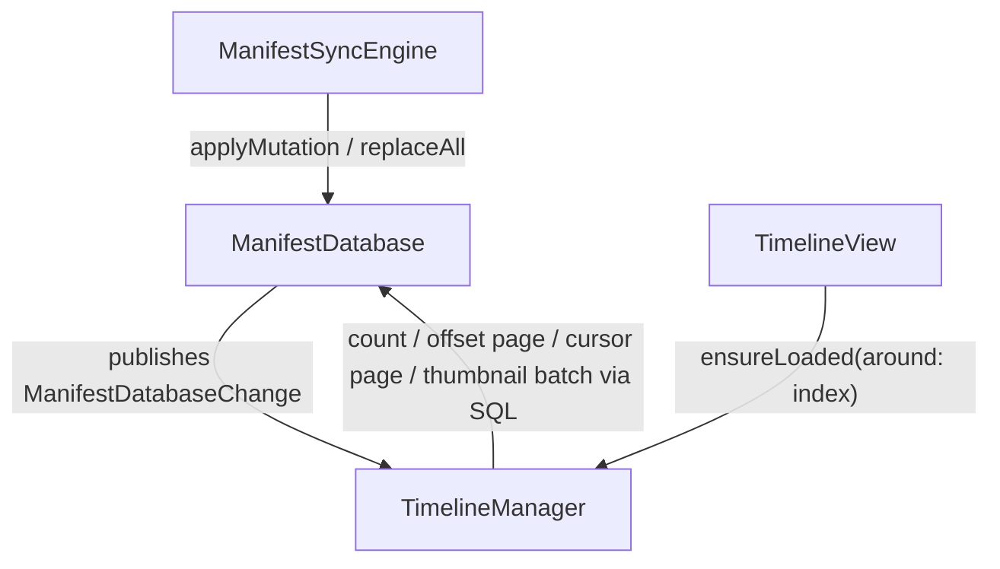

# SQLite Manifest Cache

Replycant iOS persists manifests in SQLite (via GRDB) through GitDB so timeline and manifest reads are local, deterministic, and fast across app launches.

## Components

- `ManifestDatabase`: stores registered manifest kinds in `manifests_{kind}` tables plus sync metadata.
- `ManifestSyncEngine`: syncs git commit transitions into database mutations.
- `ManifestRegistry`: app registers manifest kinds, extracted SQL columns, and indexes.
- `DefaultManifestManager`: runs app SQL queries through GitDB's generic query API.
- `TimelineManager`: consumes pagination and change events for sparse timeline rendering.

## Data Flow

## Sparse Timeline Loading

- Timeline length is based on `countTimelineOriginals`.
- Grid cells are indexed by `0..<totalCount`.
- `TimelineManager` keeps one contiguous loaded region:
  - `loadedOffset` (global index of first loaded item)
  - `loadedItems`
  - `olderCursor` / `newerCursor`
- Random jump: clear region and load via `loadTimelinePage(offset:limit:)`.
- Sequential scroll: extend via `loadTimelinePage(before:)` or `loadTimelinePage(after:)`.
- New thumbnail sets are loaded with `loadThumbnailsByOriginalRefs` (`[String: ThumbnailSetManifest]`).

## Reactive Change Publishing

After every write, `ManifestDatabase` emits:

- `.incremental(ManifestMutation)` for surgical updates.
- `.fullReplace` for full cache rebuild/reset.

`ManifestMutation` includes:

- `added: [any Manifest]`
- `removed: [(kind: String, id: String)]`

This lets `TimelineManager` rebuild sparse state deterministically while app-specific projections remain query-driven.

## Cache Lifecycle

The shared sqlite file stays open for the process lifetime. Reset and wipe paths follow one invariant so GRDB never reads a deleted vnode:

- Index rebuilds (`hydrateIndex(resetDatabase:)`) truncate tables in place and keep the live connection.
- Full wipes close the GRDB queue before unlinking the file.
- Every holder of the shared database, including `GitDBManager`, rebinds when `ManifestLoaderManager` broadcasts invalidation.
