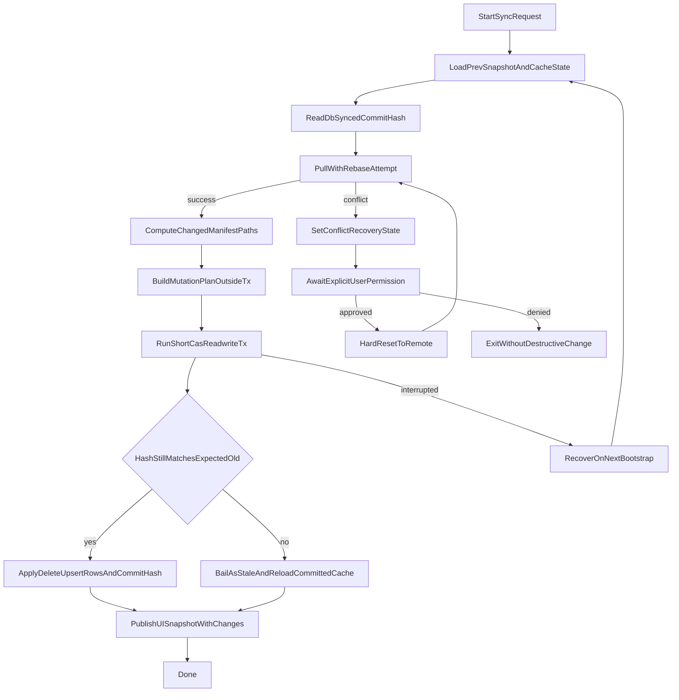

# Webapp

The Replycant webapp keeps a browser-local cache synchronized with the remote Git repository while preserving a defined recovery path for interrupted sync operations.

## Sync Algorithm

The webapp sync loop runs the following phases:

1. `beginSync`: mark UI as syncing and clear stale errors.
2. `readDbSyncedHash`: read `syncedCommitHash` from IndexedDB metadata and treat it as the diff base.
3. `pullWithRebase`: fetch remote branch and fast-forward local checkout (rebase-style behavior).
4. `computeDiffstatPaths`: compute changed `manifests/*.yaml` paths between old DB hash and new head.
5. `buildMutationPlan`: parse old/new blobs per changed path and build deterministic delete/upsert sets.
6. `applyCasTransaction`: in one short IndexedDB readwrite transaction, compare expected old hash and only then apply rows + new hash.
7. `publishSnapshot`: update UI with new objects, commit hash, and change counts.

### Replycant webapp incremental sync notes

- The compare-and-swap transaction is the IndexedDB equivalent of `UPDATE ... WHERE commithash = oldhash`.
- If two contenders race, one commit hash transition succeeds and the other sees `stale`, skips writes, and reloads committed cache.
- Manifest renames naturally become delete+upsert because path-level diffstat is resolved into old-blob and new-blob keys.
- The expensive work (fetch, diffstat, blob reads, parsing) runs outside the write transaction to avoid long-lived IndexedDB locks.

## Crash Safety

- IndexedDB metadata stores `syncState`, `stagedCommitHash`, and `syncedCommitHash`.
- Sync first writes `syncState=in_progress`, then performs the object-table replacement.
- If the browser crashes before commit, bootstrap recovery clears the in-progress marker and keeps the previously committed cache generation.
- The UI and cache are considered valid only when `syncState=idle` and `syncedCommitHash` points to the revision represented by cached objects.

## Conflict Recovery

- When pull/rebase cannot reconcile local state, sync enters a recoverable conflict state.
- The UI surfaces an explicit `Reset to remote` action.
- Destructive reset is only executed after user permission is granted.

## Setup and Identity Lifecycle

The webapp now owns mTLS device identity in the browser instead of reading `device.key` and `device.crt` from server disk:

1. On first visit, the app asks for the CA server URL.
2. The browser discovers `{ca, url}` from `/config.json` and stores it in localStorage.
3. The browser configures the local proxy with that discovered CA and upstream URL. The proxy derives every backend service from the git origin: `{origin(url)}/lfs`, `/decryptd`, and `/transcoded`, since gitd fronts them all.
4. The app asks for a device name. Plain browser tabs also require a password; the Electron desktop app does not when OS keyring encryption is available.
5. The app generates a P-256 key pair, self-signed certificate, and age X25519 key in-browser.
6. Private identity material is always AES-GCM encrypted before `localStorage` persistence. Electron wraps with an OS-keyring-protected device key (`safeStorage`); browsers wrap with a PBKDF2-derived key from the user password.
7. On later launches, Electron auto-unlocks via the OS keyring. Browser tabs prompt for the password, decrypt into RAM, and start sync.

Existing cleartext identity records are rejected and force a fresh onboarding flow.

The proxy keeps setup only in memory, so each page load replays stored setup config from localStorage before sync begins.

## QR Authorization Flow

After key generation the app shows a QR payload containing device-linking identity fields:

- `pubkey`: SSH-format public key
- `age_pubkey`: age X25519 public key
- `name`: user-provided device name
- `uuid`: generated device identifier
- `ca_hash`: SHA256 hash of CA certificate DER bytes (hex)

- iOS scans the QR, verifies `ca_hash` against its configured CA, and commits the key to `pubkeys/` in the GitDB repository.
- While QR is visible, the webapp periodically probes Git connectivity.
- Once authorized, the app proceeds into clone/sync and shows transfer progress.

## Request-Time mTLS Forwarding

Browsers cannot perform native mTLS for `isomorphic-git` and object media fetches in this architecture, so the webapp proxy handles upstream TLS:

- Browser attaches base64-encoded client key + client certificate headers on each `/api/git/*`, `/api/lfs/*`, `/api/decryptd/*`, and `/api/transcoded/*` request.
- Browser-provided setup config supplies upstream CA and base URLs to the proxy at runtime.
- Proxy builds per-request HTTPS agent credentials and forwards upstream.
- Credentials are not persisted server-side.

This keeps identity ownership in the browser while preserving mTLS enforcement upstream for every service gitd fronts.

### Session-Scoped Credentials for Direct-Play Video

Direct-play video sets `video.src` and lets the media element issue the request,
and a media element cannot attach custom headers. To authenticate those
requests, the browser posts its identity once to `POST /api/setup/session` after
unlock; the proxy validates it, holds it in memory, and binds it to an
`httpOnly` `SameSite=Strict` session cookie.

Per-request headers always take precedence over session material, so a request
carrying its own identity is never attributed to another browser's session.
Because the store is in memory, a proxy restart drops the session; the
direct-play path re-registers once and retries on a video error rather than
requiring a reload. HLS playback does not need this, since hls.js sets headers
on every segment fetch itself.

See [ADR-0011](https://github.com/mr-andreas/replycant/blob/main/webapp/adr/0011-session-scoped-mtls-material.md).
