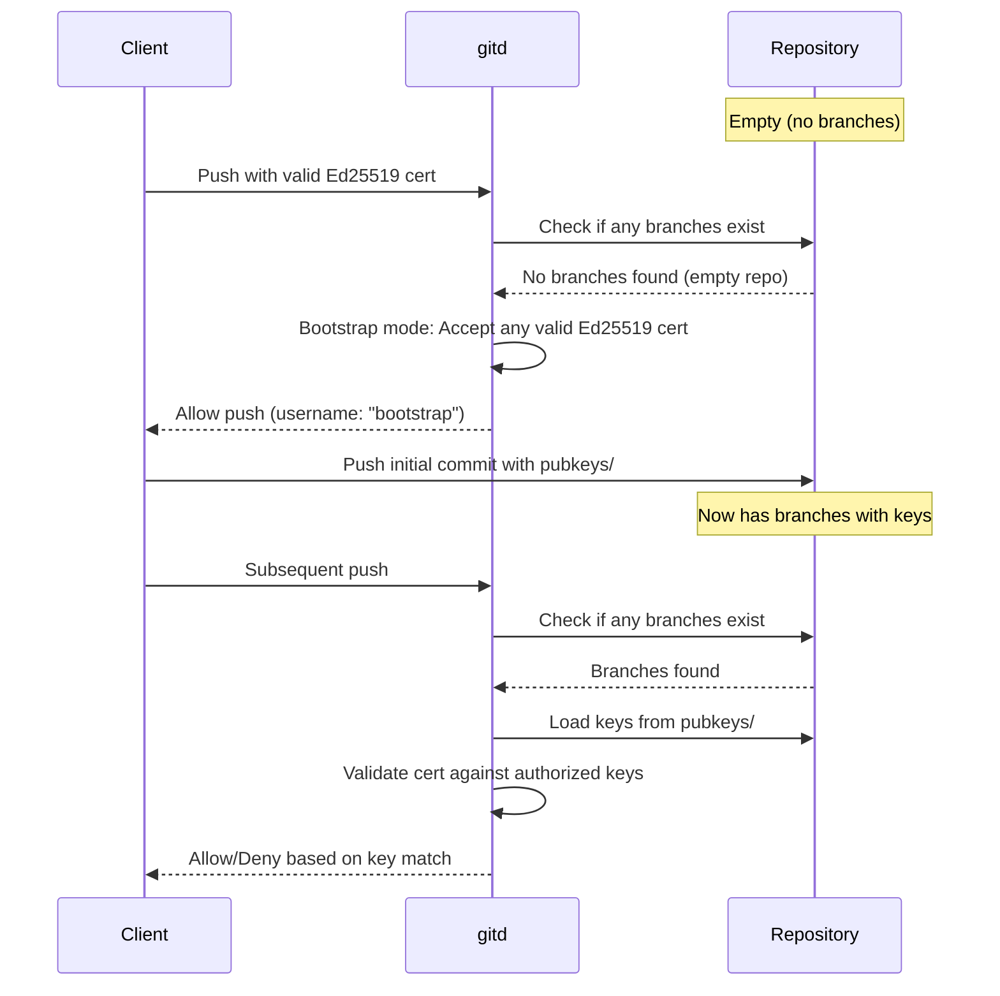

# ADR 0001: gitd - mTLS Authentication with Ed25519 Keys

## Status

Superseded by [ADR-0002](0002-gitd-p256-certificates.md)

## Context

We need a secure Git server that:

1. Provides authenticated access to Git repositories over HTTPS
2. Uses cryptographic keys that can serve multiple purposes (mTLS, PGP signing)
3. Integrates with standard Git clients without requiring custom software
4. Stores authorization data within the repository itself for self-contained management
5. Leverages proven implementations (git-http-backend) rather than reimplementing Git protocol

Traditional Git hosting solutions either require password authentication (insecure for automation), SSH keys (different infrastructure), or proprietary authentication mechanisms. We want a solution that uses modern cryptography (Ed25519) and can be easily integrated with existing Git workflows.

## Decision

### Architecture

We will implement `gitd` as a Go-based HTTPS server that wraps `git-http-backend` with mTLS authentication:

```
Git CLI Client → mTLS → gitd → CGI → git-http-backend → Repository
                          ↓
                    Read pubkeys/ from main branch
```

### Key Format: Ed25519 in SSH Format

Authorized public keys are stored in `pubkeys/` directory on the main branch, one file per user (`username.pub`), using standard SSH public key format:

```
ssh-ed25519 AAAAC3NzaC1lZDI1NTE5AAAA... user@host
```

**Rationale:**
- Ed25519 provides modern, secure cryptography with small key sizes
- SSH format is widely understood and supported by standard tools (ssh-keygen)
- Same Ed25519 key can be used for:
  - mTLS client certificates (self-signed X.509 with Ed25519 public key)
  - PGP key for commit signing (Ed25519 can be imported to GnuPG)
  - SSH authentication (if needed in future)
- Git CLI natively supports client certificates via `http.sslCert` and `http.sslKey`

### Authentication Flow

1. Server requires TLS 1.3 with client certificate authentication
2. Client presents self-signed X.509 certificate containing Ed25519 public key
3. Server extracts Ed25519 public key from certificate (32 bytes)
4. Server loads authorized keys from `pubkeys/` on main branch (cached)
5. Server compares raw Ed25519 bytes for authentication
6. If authorized, request is proxied to git-http-backend via CGI

### Bootstrap Mode for Empty Repositories

To solve the chicken-and-egg problem where an empty repository has no keys to authorize the first push, the authenticator implements a **bootstrap mode**:



**Bootstrap Mode Behavior:**

1. **Detection:** The authenticator checks if any branches exist in the repository
2. **Empty Repository:** If no branches exist at all, the repository is considered empty
3. **Permissive Authentication:** Any valid Ed25519 client certificate is accepted, returning username `"bootstrap"`
4. **First Push:** The client can push their initial commit(s), which should include their public key in `pubkeys/`
5. **Normal Mode:** Once any branch exists, normal key-based authentication resumes immediately

**Important:** A repository is only considered empty if it has **no branches at all**. If any branch exists (even if it's not "main"), normal authentication applies and authorized keys are required.

**Security Considerations:**

- Bootstrap mode only applies when the repository is **completely empty** (no branches at all)
- The first user to push gains control by adding their key to `pubkeys/`
- After the first push creates any branch, all subsequent requests require authorized keys
- This creates a "first-come, first-served" trust model for repository initialization
- Repository administrators should initialize repositories in a controlled environment
- For production use, consider pre-initializing repositories with authorized keys

**Race Condition Mitigation:**

To prevent multiple clients from simultaneously bootstrapping a repository, the server implements a bootstrap mutex:

1. When the authenticator detects an empty repository, it returns `ErrUnauthorizedBootstrap`
2. The server catches this error and acquires a bootstrap mutex lock
3. After acquiring the lock, the server re-checks if the repository is still empty
4. If still empty, the push proceeds; if not, normal authentication applies
5. The mutex is released after the git operation completes (via defer)

This ensures that only one client can perform the initial bootstrap push, even if multiple clients attempt to push simultaneously. Subsequent clients will either:
- Wait for the mutex and then find the repository is no longer empty (requiring normal auth)
- Successfully authenticate if their key was added by the first push

### Implementation Components

**`gitd/auth.go`:**
- Loads and caches public keys from repository using go-git
- Parses SSH-format Ed25519 keys (base64-encoded wire format)
- Extracts Ed25519 keys from X.509 certificates
- Compares raw key bytes for authentication
- Implements bootstrap mode for empty repositories (accepts any valid Ed25519 cert)

**`gitd/server.go`:**
- HTTPS server with TLS 1.3 and required client certificates
- CGI handler that invokes git-http-backend
- Health checks for startup validation
- Bootstrap mutex to prevent race conditions during initial repository setup

**`bin/gitd/main.go`:**
- CLI using kong for argument parsing
- Minimal wrapper around server components

### Client Setup

Users generate Ed25519 keys and self-signed certificates:

```bash
# Generate Ed25519 private key
openssl genpkey -algorithm ED25519 -out client.key

# Create self-signed certificate
openssl req -new -x509 -key client.key -out client.crt -days 365

# Extract SSH public key for repository
ssh-keygen -y -f client.key > username.pub

# Configure Git
git config http.sslCert /path/to/client.crt
git config http.sslKey /path/to/client.key
git config http.sslVerify false  # for self-signed server cert (or use proper CA)
```

**For existing repositories:** Add `username.pub` to `pubkeys/` directory in repository's main branch.

**For new/empty repositories (Bootstrap Mode):**

```bash
# Clone the empty repository
git clone https://gitd-server/repo.git
cd repo

# Create pubkeys directory and add your key
mkdir pubkeys
cp /path/to/username.pub pubkeys/

# Make initial commit
git add pubkeys/username.pub
git commit -m "Initial commit: add authorized key"

# Push to main branch (bootstrap mode allows this)
git push origin main
```

After the first push, normal authentication applies and only authorized keys can push.

## Consequences

### Positive

- **Strong Authentication:** Ed25519 provides modern, secure cryptography
- **Standard Tooling:** Works with unmodified Git CLI and standard key generation tools
- **Self-Contained:** Authorization data stored in repository itself
- **Multi-Purpose Keys:** Same key for mTLS, PGP signing, and potentially SSH
- **Proven Implementation:** Delegates Git protocol to standard git-http-backend
- **Performance:** Key caching minimizes repository reads
- **Auditability:** Authorization changes tracked in Git history
- **Bootstrap-Friendly:** Empty repositories can be initialized without manual intervention

### Negative

- **Initial Setup Complexity:** Users must generate certificates and configure Git
- **Certificate Management:** Self-signed certificates require `sslVerify=false` unless CA infrastructure is added
- **Single Repository:** Current implementation serves one repository (can be extended)
- **Key Revocation:** Requires committing changes to main branch (eventual consistency)
- **Platform Dependency:** Requires git-http-backend to be installed on server

### Risks

- **Credential Exposure:** Private keys must be protected on client systems
- **Cache Timing:** Key revocations take effect after cache expiry (default 5 minutes)
- **Trust on First Use:** Bootstrap mode uses a "first-come, first-served" model; malicious actors could claim uninitialized repositories if they reach them first
- **Bootstrap Window:** Although a mutex prevents concurrent bootstrap attempts, there's still a brief window where an empty repository is vulnerable to the first client that connects

## Alternatives Considered

### Alternative 1: SSH Keys with OpenSSH

Pros: Mature, well-understood, built into Git
Cons: Separate infrastructure, different from HTTPS workflows, no PGP compatibility

### Alternative 2: HTTP Basic Auth with Tokens

Pros: Simple, works everywhere
Cons: Token management complexity, not cryptographic proof of identity, no PGP integration

### Alternative 3: OAuth/OIDC

Pros: Industry standard, supports SSO
Cons: External dependencies, complex setup, still needs separate keys for commit signing

### Alternative 4: Store X.509 Certificates Directly

Pros: Exact format used for authentication
Cons: Larger files, less compatible with other tools, cannot derive SSH keys

## Notes

This ADR documents the initial implementation. Future enhancements may include:
- Support for multiple repositories
- Key revocation lists (separate from pubkeys/)
- Certificate Authority integration for server certificates
- Metrics and monitoring endpoints
- Graceful key cache refresh on repository changes

